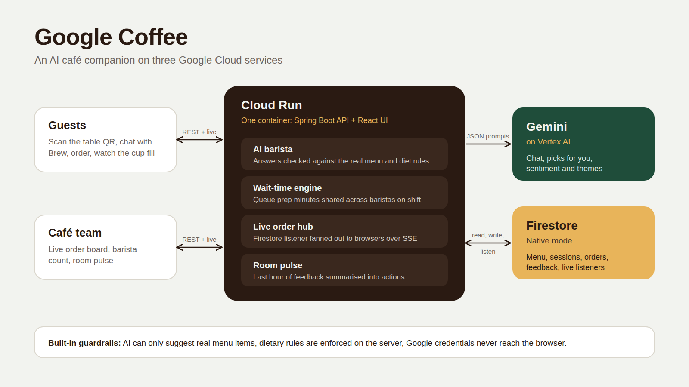

# Google Coffee — Café Companion

An AI-powered café experience: guests order from their table with help from an AI barista and watch their order being made live, while the café team gets a live order board and an AI summary of how the room feels.

This branch (`google-coffee-local`) runs **entirely on your own machine at zero cloud cost**:

| Component | What it does here |
|---|---|
| **Ollama** (`llama3.2`) | "Brew", the conversational AI barista; personalised "picked for you" recommendations; the staff **Room pulse** (sentiment, themes, suggested actions from live feedback) |
| **PostgreSQL** | Menu, guest sessions, orders, feedback, café settings; every order change is pushed live to the order board and the guest's tracker |
| **Spring Boot + React** | One process serving the API and UI; shared publicly through a Cloudflare Tunnel |


The original Google Cloud version (Gemini on Vertex AI, Firestore, Cloud Run) is still in the code and one setting away. See [Google Cloud stack](#google-cloud-stack-profile-gcp) below.

## Two stacks, one codebase (branch `google-coffee-local`)

The app talks to its infrastructure only through small interfaces in `backend/.../port`. A Spring profile picks the implementation:

| Concern | `local` profile (default on this branch) | `gcp` profile |
|---|---|---|
| AI model | Ollama (`llama3.2` by default) | Gemini on Vertex AI |
| Database | PostgreSQL + Flyway migrations | Firestore |
| Live order feed | In-process events after each DB write | Firestore snapshot listener |
| Hosting | Your laptop (+ optional Cloudflare Tunnel) | Cloud Run |

Switch with `SPRING_PROFILES_ACTIVE=local` or `SPRING_PROFILES_ACTIVE=gcp` in `.env`. Everything else (UI, API, grounding rules, wait-time engine, room pulse, staff auth) is shared.

### Run the local stack

Prerequisites: Java 21, Maven 3.9+, Node 20.19+/22, Docker Desktop, Ollama with the model pulled (`ollama pull llama3.2`).

```bash
cp .env.example .env        # set STAFF_PIN and STAFF_TOKEN_SECRET; keep SPRING_PROFILES_ACTIVE=local
./run-local.sh              # starts Postgres in Docker, checks Ollama, builds the UI, starts the app
```

- Guests: http://localhost:8080/?table=7
- Staff: http://localhost:8080/staff

Everything in containers instead (Ollama stays native): `docker compose --profile app up -d --build`

### Share it publicly with Cloudflare Tunnel

```bash
brew install cloudflared
cloudflared tunnel --url http://localhost:8080
```

It prints a random `https://….trycloudflare.com` URL. Quick tunnels buffer Server-Sent Events, so the UI automatically falls back to refreshing every 3 seconds (the status shows "Auto-refresh"). For true live updates and a stable URL, create a named tunnel on a free Cloudflare account with your own domain.

### Local troubleshooting

| Symptom | Fix |
|---|---|
| Log: "Ollama not reachable" | Open the Ollama app or run `ollama serve` |
| Log: "model 'llama3.2' is not pulled" | `ollama pull llama3.2`, or set `OLLAMA_MODEL` to a model from `ollama list` |
| Brew replies "taking a quick breather" | The model timed out or returned invalid JSON; check `Ollama call failed…` in the log, raise `OLLAMA_TIMEOUT_SECONDS` |
| Port 5432 already in use | Set `POSTGRES_PORT=5433` and `DATABASE_URL=jdbc:postgresql://localhost:5433/googlecoffee` in `.env` |
| Reset all local data | `docker compose down -v` |


## Features

**Guests** (mobile web, opened from a table QR code such as `/?table=7`)
- Enter a name, table and dietary preferences (vegan, dairy-free, less sugar, no caffeine, prefer hot/cold). No login.
- **Picked for you**: three AI recommendations based on time of day, preferences and what they already ordered.
- **Ask Brew**: chat with the AI barista. Every suggestion becomes a card that can be added to the order with one tap.
- **Better waits**: the cart shows "ready in about N min" *before* ordering; after ordering a coffee cup fills up live as the bar works on it, with pickup code, ETA and queue position.
- **Feedback** in two taps (face rating plus optional comment).

**Café team** (`/staff`, PIN protected)
- Live order board: New → Brewing → Ready → Collected (or cancel), late orders highlighted.
- Set how many baristas are on the bar; every guest's ETA updates instantly.
- **Room pulse**: the AI model summarises the last hour of feedback into mood, themes and 2–3 concrete actions.

## How the AI is kept honest (grounding)

- The model (Ollama or Gemini) receives the real menu and must answer in JSON with item **ids**.
- The server drops any id not on the menu and any item that breaks the guest's dietary preferences (`PreferenceRules`). The model can never invent a dish or a price, and can never override "vegan".
- Prices and prep times always come from the server, never the browser.
- Guest text is treated as data inside the prompt; history and message sizes are capped.
- If the model is slow or unavailable (timeout: 90 s for Ollama, 25 s for Gemini), the app falls back to rule-based picks and ratings-only pulse. The guest flow never breaks.

## How wait times are estimated

No historical data exists yet, so the model is transparent rather than "ML":
- order prep time = slowest item + 1 min per extra item
- queue ETA = sum of prep minutes of orders ahead of you (orders already being made count half) ÷ baristas on the bar

See `EtaCalculator` and its unit tests.

---

---

# Google Cloud stack (profile `gcp`)

Everything below applies when `SPRING_PROFILES_ACTIVE=gcp`.



## 1. Prerequisites

| Tool | Version |
|---|---|
| Java (JDK) | 21 |
| Maven | 3.9+ |
| Node.js | 20.19+ or 22 LTS (Vite 8 requirement) |
| gcloud CLI | recent |

A Google Cloud project with **billing enabled** (credits are fine).

## 2. One-time Google Cloud setup (≈5 min)

```bash
gcloud auth login
gcloud config set project YOUR_PROJECT_ID

gcloud services enable aiplatform.googleapis.com firestore.googleapis.com \
  run.googleapis.com cloudbuild.googleapis.com artifactregistry.googleapis.com

# Firestore in Native mode (skip if you already created one)
gcloud firestore databases create --location=asia-south1

# Credentials the app uses when running locally
gcloud auth application-default login
gcloud auth application-default set-quota-project YOUR_PROJECT_ID
```

Then confirm your model is available: Vertex AI → Model Garden → Gemini. The default is `gemini-2.5-flash` in `us-central1`. If your project uses a different model or region, change `GEMINI_MODEL` / `GEMINI_LOCATION` in `.env`.

## 3. Configure

```bash
cp .env.example .env
# edit .env: set SPRING_PROFILES_ACTIVE=gcp, GCP_PROJECT_ID, STAFF_PIN and a long STAFF_TOKEN_SECRET (openssl rand -hex 32)
```

## 4. Run locally

### Option A: one command (recommended for a demo)

```bash
./run-local.sh
```

- Guests: http://localhost:8080/?table=7
- Staff: http://localhost:8080/staff (PIN from `.env`, default `2468`)

On first start the app seeds the sample menu into Firestore (collection `menu_items`).

### Option B: dev mode with hot reload (two terminals)

```bash
# Terminal 1: API on :8080
set -a; source .env; set +a
cd backend && mvn spring-boot:run

# Terminal 2: UI on :5173 (proxies /api to :8080)
cd frontend && npm install && npm run dev
```

Open http://localhost:5173/?table=7 and http://localhost:5173/staff.

### Try the full loop in two browser windows

1. Guest window: enter a name, pick "Less sugar", ask Brew for "something cold", add a suggestion, place the order.
2. Staff window: the order appears instantly. Press **Start**, then **Mark ready**. Watch the guest's cup fill and steam.
3. Leave feedback from the guest window (for example "freezing near the window"), then press refresh on **Room pulse**.

### Tests

```bash
cd backend && mvn test
```

Unit tests cover the wait-time maths, dietary grounding rules, order status transitions, staff token signing and lockout, and JSON cleanup of model output. They need no cloud access.

## 5. Deploy to Cloud Run

```bash
./deploy.sh            # uses values from .env; REGION defaults to asia-south1
```

The script enables APIs, creates a least-privilege service account (`roles/datastore.user`, `roles/aiplatform.user`), builds with Cloud Build and deploys. It prints the guest and staff URLs at the end. Tip: turn the guest URL (`…/?table=7`) into a QR code for each table.

---

## API overview

| Method | Path | Purpose |
|---|---|---|
| GET | `/api/menu` | Menu |
| GET | `/api/cafe/status` | Queue busyness and wait for a coffee |
| POST | `/api/sessions` | Start a guest session `{name, table, preferences}` |
| POST | `/api/chat` | Talk to Brew `{sessionId, message, history}` |
| GET | `/api/recommendations?sessionId=` | Personalised picks |
| POST | `/api/orders/estimate` | Wait estimate for a cart |
| POST | `/api/orders` | Place order |
| GET | `/api/orders/{id}/stream?sessionId=` | Live order updates (SSE) |
| POST | `/api/feedback` | Rating and comment |
| POST | `/api/staff/login` | PIN → signed token |
| GET | `/api/staff/stream?token=` | Live order board (SSE) |
| PATCH | `/api/staff/orders/{id}` | Change status (header `X-Staff-Token`) |
| PUT | `/api/staff/settings` | Baristas on bar |
| GET | `/api/staff/pulse` | Room pulse |

## Project layout

```
backend/    Spring Boot 3.5, Java 21
  port/      Interfaces: AiClient, MenuStore, SessionStore, OrderStore, FeedbackStore, SettingsStore, OrderFeed
  adapter/   local/ (Ollama, PostgreSQL) and gcp/ (Firestore) implementations, picked by Spring profile
  ai/        GeminiService (gcp), BaristaService (grounded chat and picks), PulseService
  live/      LiveOrderHub: Firestore snapshot listener → SSE
  service/   Menu, sessions, orders, feedback, settings, EtaCalculator, PreferenceRules
  security/  StaffAuth: PIN + HMAC-signed expiring token, login lockout
  web/       REST controllers, validation and error handling
frontend/   React 19 + Vite + Tailwind CSS 4
docs/       architecture-local.* (local stack) and architecture.* (Google Cloud stack)
Dockerfile  multi-stage: UI build → jar build → slim JRE
```

## Troubleshooting

| Symptom | Fix |
|---|---|
| Firestore database "default" not found | In `.env` the value must be quoted: `FIRESTORE_DATABASE="(default)"` |
| Log says "Could not reach Firestore … Serving the bundled sample menu" | Run `gcloud auth application-default login`, check `GCP_PROJECT_ID`, and make sure the Firestore database exists |
| Brew replies "taking a quick breather" | Gemini call failed. Check the log line `Gemini call failed…`: usually the model isn't available in `GEMINI_LOCATION`, the Vertex AI API isn't enabled, or ADC has no quota project |
| `PERMISSION_DENIED` on Cloud Run | Re-run `deploy.sh` (it grants the two roles) and wait a minute for IAM to propagate |
| Cloud Build permission error on first deploy | Grant the Cloud Build/Compute default service account `roles/cloudbuild.builds.builder` in IAM, then retry |
| `npm ci` fails | Use Node 20.19+ or 22 |

## Known limits (deliberate, to keep scope tight)

- One café, English only, pay at counter.
- Staff auth is a single shared PIN. For a real rollout, move secrets to Secret Manager and use per-staff accounts.
- Wait times are a transparent heuristic; with a few weeks of order data they could be replaced by a learned model.
- The menu shown is sample data for a third-wave style café, not any real café's menu.

## CI/CD (Cloud Build → Artifact Registry → Cloud Run)

Every push to `main` runs `cloudbuild.yaml`: unit tests → build image → push to Artifact Registry → deploy that exact image to Cloud Run → smoke test `/api/health`. Staff PIN and token secret live in Secret Manager.

1. Run `./setup-cicd.sh` once (after a first `./deploy.sh`).
2. Push the project to GitHub (`.env` is git-ignored).
3. Console → Cloud Build → Repositories → 2nd gen → Create host connection (GitHub, region `asia-south1`) → Link repository.
4. Console → Cloud Build → Triggers → Create (region `asia-south1`): event "Push to a branch", branch `^main$`, config `cloudbuild.yaml`, service account `google-coffee-build@PROJECT.iam.gserviceaccount.com`.
5. Push a commit and watch Cloud Build → History.

After CI/CD is set up, deploy through the pipeline rather than `deploy.sh` (which sets the PIN as a plain env var).
